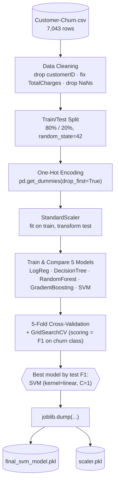
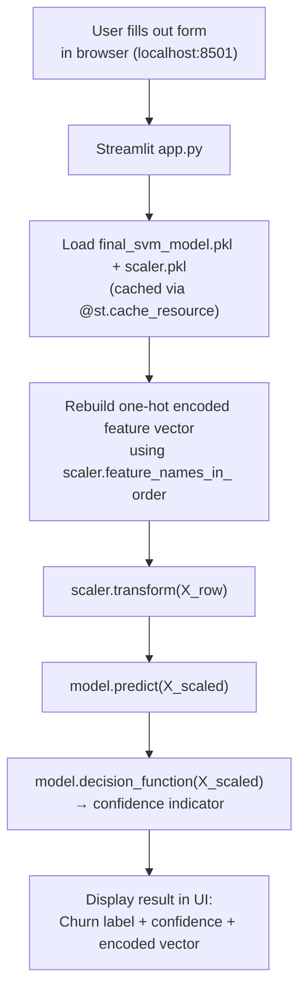

# 📉 Customer Churn Prediction — SVM + Streamlit

An end-to-end machine learning project that predicts whether a telecom
customer is likely to **churn** (cancel their service), built on the
IBM Telco Customer Churn dataset. The project covers data cleaning, EDA,
model comparison, hyperparameter tuning, and a deployed **interactive
Streamlit GUI** for real-time predictions.

> **Final model:** Support Vector Machine (linear kernel, `C=1`) —
> chosen after comparing 5 algorithms, selected for best test-set
> performance (80% accuracy, 0.58 F1-score on the churn class).

---

## 📁 Project Structure

```
Customer-Churn-Prediction/
│
├── Untitled.ipynb           # Full training notebook (EDA, modeling, tuning)
├── Customer-Churn.csv       # Raw dataset (IBM Telco Customer Churn)
│
├── app.py                   # Streamlit GUI for live predictions
├── final_svm_model.pkl      # Trained SVM model (exported with joblib)
├── scaler.pkl               # StandardScaler fitted on training data
├── requirements.txt         # Python dependencies
│
└── README.md                # Project documentation (this file)
```

> ⚠️ **Important:** `app.py`, `final_svm_model.pkl`, and `scaler.pkl` must
> all live in the **same folder** to run the app — the app loads the
> `.pkl` files by relative path.

---

## 🏗️ System Architecture

The project has two distinct pipelines: an **offline training pipeline**
(run once, in the notebook) that produces the saved model artifacts, and a
**runtime inference pipeline** (the Streamlit app) that reuses those
artifacts to serve live predictions. Separating these matters because it
means the app never retrains or recomputes anything — it only replays the
exact same encode → scale → predict steps the notebook already proved out.

### 1. Offline Training Pipeline (`Untitled.ipynb`)



### 2. Runtime / Inference Pipeline (`app.py`)



**Why this separation matters:** the app has zero model logic of its own —
it only re-derives the same numeric input the notebook's training code
would have produced for an identical customer, then calls `.predict()` on
the already-tuned model. This is what guarantees the GUI's predictions
match what the notebook's evaluation would have given for the same input.

---

## 🧩 Problem Statement

Telecom companies lose significant revenue to customer churn. The goal of
this project is to build a classification model that predicts, from a
customer's account and service details, whether they are likely to leave
(`Churn = Yes`) or stay (`Churn = No`) — and to make that model usable
through a simple GUI rather than leaving it buried in a notebook.

---

## 📊 Dataset

- **Source:** IBM Telco Customer Churn dataset (`Customer-Churn.csv`, included in this repo)
- **Raw shape:** 7,043 rows × 21 columns
- **After cleaning:** 7,032 rows × 20 features + target (`Churn`)
- **Target variable:** `Churn` (`Yes` / `No`) — imbalanced, ~26.6% churn rate
- **Feature types:**
  - Demographics: `gender`, `SeniorCitizen`, `Partner`, `Dependents`
  - Account info: `tenure`, `Contract`, `PaperlessBilling`, `PaymentMethod`, `MonthlyCharges`, `TotalCharges`
  - Services: `PhoneService`, `MultipleLines`, `InternetService`, `OnlineSecurity`, `OnlineBackup`, `DeviceProtection`, `TechSupport`, `StreamingTV`, `StreamingMovies`

### Cleaning steps applied
1. Dropped `customerID` (identifier, not predictive).
2. Converted `TotalCharges` from string to numeric (`pd.to_numeric(..., errors='coerce')`).
3. Dropped rows where `TotalCharges` became `NaN` (11 rows — new customers with blank billing history).

---

## 🔍 Exploratory Data Analysis

EDA was performed using `seaborn`/`matplotlib` to understand feature
distributions and their relationship with churn:

- **Numerical features** (`MonthlyCharges`, `TotalCharges`, `tenure`): histograms with KDE overlays.
- **Categorical features** (`Contract`, `InternetService`, `PaymentMethod`, `TechSupport`, `OnlineSecurity`, `SeniorCitizen`): count plots split by `Churn`.
- **Numeric vs. target:** box plots of `TotalCharges`, `MonthlyCharges`, and `tenure` grouped by `Churn`.
- **Correlation heatmap** of numeric features.

**Key observations:**
- Customers on **month-to-month contracts** churn far more than those on 1- or 2-year contracts.
- **Fiber optic** internet customers show a notably higher churn rate than DSL or no-internet customers.
- Customers **without** `OnlineSecurity` or `TechSupport` churn more.
- Short-**tenure** customers churn more than long-tenure customers.

---

## ⚙️ Preprocessing Pipeline

```
Raw data
  → drop customerID
  → TotalCharges → numeric, drop NaNs
  → train_test_split (80/20, random_state=42)
  → pd.get_dummies(drop_first=True)   # one-hot encode categoricals
  → StandardScaler                     # fit on train, transform on test
  → model.fit(X_train_scaled, y_train)
```

This produces **30 final features** after encoding (confirmed from the
fitted scaler's `feature_names_in_`).

---

## 🤖 Models Compared

Five classifiers were trained and evaluated on the same 80/20 split before any tuning:

| Model | Accuracy | Precision (Yes) | Recall (Yes) | F1 (Yes) |
|---|---|---|---|---|
| Logistic Regression | 0.787 | 0.62 | 0.52 | 0.56 |
| Decision Tree | 0.725 | 0.48 | 0.52 | 0.50 |
| Random Forest | 0.785 | 0.63 | 0.48 | 0.54 |
| Gradient Boosting | 0.790 | 0.64 | 0.48 | 0.55 |
| SVM (RBF, untuned, default params) | 0.734 | 0.00 | 0.00 | 0.00 |

> ⚠️ The untuned baseline SVM collapsed to predicting every customer as
> "No churn" — see [Known Issues](#-known-issues--honest-limitations) below
> for why, and how the final tuned model avoided this.

### 5-Fold Cross-Validation (F1-score on churn class)

| Model | Mean CV F1 (Yes) |
|---|---|
| Logistic Regression | 0.6065 |
| Decision Tree | 0.5142 |
| Random Forest | 0.5670 |
| SVM (RBF, default) | 0.5780 |
| Gradient Boosting | 0.5960 |

### Hyperparameter Tuning (`GridSearchCV`, scoring = F1 on churn class, cv=5)

| Model | Best Parameters | Best CV F1 |
|---|---|---|
| Logistic Regression | `C=10`, `solver='liblinear'` | 0.6078 |
| Gradient Boosting | `learning_rate=0.1`, `max_depth=3`, `n_estimators=100` | 0.5958 |
| **SVM** | **`C=1`, `kernel='linear'`, `gamma='scale'`** | **0.5969** |

### Final Test-Set Performance (tuned models)

| Model | Accuracy | Precision (Yes) | Recall (Yes) | F1 (Yes) |
|---|---|---|---|---|
| Logistic Regression (tuned) | 0.79 | 0.62 | 0.52 | 0.57 |
| Gradient Boosting (tuned) | 0.79 | 0.64 | 0.48 | 0.55 |
| **SVM (tuned)** | **0.80** | **0.64** | **0.54** | **0.58** |

**✅ SVM (linear kernel, `C=1`) was selected as the final model** — it had
the best balance of accuracy and churn-class F1-score among all tuned
candidates.

---

## 🖥️ The Streamlit App (`app.py`)

A GUI was built on top of the exact trained artifacts (`final_svm_model.pkl`,
`scaler.pkl`) — **no retraining, no logic changes.**

**Features:**
- Form-based input for all 19 raw customer attributes, grouped into
  Demographics / Services / Add-ons / Contract & Billing / Charges.
- Smart conditional fields — e.g. "Multiple Lines" auto-locks to
  "No phone service" when Phone Service is "No", mirroring the real
  dataset's constraints.
- Reconstructs the model's exact 30-column one-hot-encoded feature vector
  by reading `scaler.feature_names_in_`, so a single form submission is
  numerically identical to what the training pipeline would produce.
- Displays the predicted label plus a `decision_function()`-based
  confidence indicator (the model was trained with `probability=False`,
  so this is an honest substitute, not a calibrated probability).
- Expandable panel to inspect the exact encoded vector sent to the model.

### Running the app

```bash
pip install -r requirements.txt
streamlit run app.py
```

Then open `http://localhost:8501` in your browser.

> **Note:** Keep the project folder **out of OneDrive/Google Drive sync
> folders** where possible, and never open the `.pkl` files directly in a
> text editor (e.g. VS Code) — saving over them will corrupt the binary
> pickle data.

---

## 🛠️ Tech Stack

| Category | Tools |
|---|---|
| Language | Python 3 |
| Data handling | pandas, numpy |
| Visualization | matplotlib, seaborn |
| Modeling | scikit-learn (SVM, Logistic Regression, Decision Tree, Random Forest, Gradient Boosting) |
| Model persistence | joblib |
| GUI / Deployment | Streamlit |

---

## ⚠️ Known Issues & Honest Limitations

Documenting these transparently rather than hiding them:

1. **`get_dummies` applied separately to train/test splits.** The notebook
   one-hot-encodes `X_train` and `X_test` independently
   (`pd.get_dummies(X_train, drop_first=True)` and the same for `X_test`).
   This works only because every category happens to appear in both splits
   here — it's fragile in general. The safer approach is to encode the
   full dataset before splitting, or use `OneHotEncoder(handle_unknown='ignore')`
   fit only on the training set.
2. **The untuned baseline SVM (`kernel='rbf'`) was evaluated on unscaled
   test data** (`model_svm.predict(X_test)` instead of `X_test_scaled`),
   while it was trained on scaled data — this mismatch is why it
   degenerated to predicting "No" for every customer. This bug only
   affected the *exploratory baseline comparison*; the final tuned SVM
   (`best_svm`, from `GridSearchCV`) was correctly trained and evaluated
   on scaled data throughout, so the deployed model is unaffected.
3. **No calibrated probabilities.** The final SVM was trained with
   `probability=False` (the sklearn default), so there's no `predict_proba`.
   The app reports `decision_function()` distance as a rough substitute.
   If you need true churn-risk probabilities (e.g. to rank customers by
   risk), retrain with `SVC(..., probability=True)` or switch to a model
   with native probability outputs (Logistic Regression, Gradient Boosting).
4. **Moderate recall on the churn class (0.54).** The model misses close
   to half of actual churners. Given the class imbalance (~27% churn
   rate), this is a known trade-off of optimizing F1 at this threshold —
   consider adjusting the decision threshold or using class weighting if
   recall on churners matters more than overall accuracy.

---

## 🚀 Possible Future Improvements

- Fix the train/test encoding order to prevent potential column mismatches on new data.
- Enable `probability=True` on the SVM (or use a probabilistic model) to support risk-ranking.
- Add SMOTE or class-weighting to address class imbalance and improve churn-class recall.
- Add a batch-prediction mode to the Streamlit app (upload a CSV of multiple customers at once).
- Deploy the app to Streamlit Community Cloud or similar for public access.
- Add model explainability (e.g. SHAP values) to show *why* a customer is predicted to churn.

---

## 📦 Installation (Full Project)

```bash
# Clone or download the project folder
cd Customer-Churn-Prediction

# Install dependencies
pip install -r requirements.txt

# To explore/retrain: open Untitled.ipynb in Jupyter
jupyter notebook Untitled.ipynb

# To run the prediction GUI:
streamlit run app.py
```

---

## 👤 Author

*Add your name, GitHub, and LinkedIn here.*

## 📄 License

*Add a license (e.g. MIT) here if you plan to share this publicly.*
